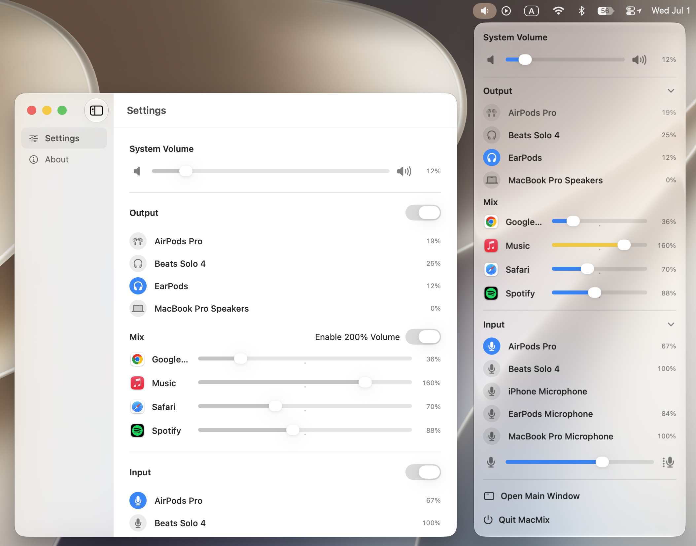

<p align="center">
  
</p>

<h1 align="center">MacMix</h1>

<p align="center">
  A native macOS menu bar audio mixer for system volume, audio devices, microphone input, and per-app sound control.
</p>

<p align="center">
  English | <a href="README.zh-CN.md">简体中文</a>
</p>

<p align="center">
  <a href="https://github.com/ljmng7/MacMix/releases/latest">
    
  </a>
</p>

<p align="center">
  <a href="#privacy">Privacy</a>
  ·
  <a href="#support">Support</a>
  ·
  <a href="#license">License</a>
  ·
  <a href="#build-from-source">Build from Source</a>
</p>

<p align="center">
  
</p>

## Overview

MacMix keeps everyday audio controls one click away in the macOS menu bar. It is designed for users who frequently switch audio devices, manage microphone input, or need finer control over the volume of individual apps.

Everything is presented in a compact native panel, so you can adjust sound without opening System Settings or interrupting your current workflow.

## Highlights

| Capability | What it does |
| --- | --- |
| System volume | Adjust the current output device volume directly from the menu bar, with DDC/CI fallback for compatible external displays. |
| Output devices | Switch between speakers, headphones, AirPods, external displays, and other available output devices. |
| Input devices | Switch microphones and control input volume from the same panel. |
| Per-app mixing | Lower individual apps or optionally boost them up to 200% while they are producing audio. |
| Menu bar first | Runs quietly as a menu bar utility, with an optional main window for settings and app information. |
| Automatic updates | Uses Sparkle to check for and install app updates. |

## Download

Download the latest `.dmg` from the [GitHub Releases page](https://github.com/ljmng7/MacMix/releases/latest).

## Requirements

- macOS 15.0 or later.
- System Audio Recording permission is required only when using per-app audio mixing.

## Installation

1. Download the latest `.dmg`.
2. Open the disk image.
3. Drag `MacMix.app` into the Applications folder.
4. Launch MacMix and open the mixer from the menu bar volume icon.

## Privacy

MacMix performs audio processing locally on your Mac.

Per-app mixing uses macOS audio process taps, so macOS requires System Audio Recording permission before MacMix can process another app's audio. MacMix uses this permission only for local real-time volume mixing.

MacMix does not record, save, or upload audio.

## Support

MacMix is completely free and open source. If you enjoy it, you can buy me a coffee to support future updates here, but genuinely not expected 🙏

<p align="center">
  <a href="https://ko-fi.com/ljmng7">
    <strong>Buy me a coffee on</strong>
    
  </a>
</p>

## License

Code is MIT; app icon/assets remain copyrighted.

The source code is licensed under the [MIT License](LICENSE). The app icon, screenshots, and brand assets are not licensed under MIT and may not be reused without permission.

## Build From Source

1. Clone the repository:

   ```sh
   git clone https://github.com/ljmng7/MacMix.git
   cd MacMix
   ```

2. Open `MacMix.xcodeproj` in Xcode.
3. Select the `MacMix` scheme.
4. Build and run the app.

## Notes

- Apps appear in the per-app mixer only while macOS reports that they are actively producing output audio.
- Per-app volume changes are stored locally and restored when matching apps appear again.
- 200% per-app volume boost is optional and can be enabled in Settings.
- External display volume fallback requires the display to support DDC/CI speaker volume (VCP `0x62`) over the current cable or dock. DisplayLink, some HDMI paths, TVs, and displays with DDC/CI disabled in their on-screen menu may not expose this control.
