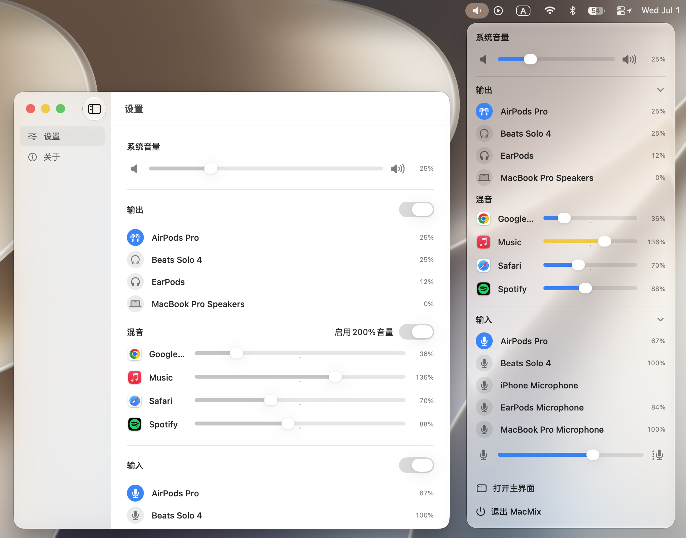

<p align="center">
  
</p>

<h1 align="center">MacMix</h1>

<p align="center">
  一款原生 macOS 菜单栏音频混音工具，用于管理系统音量、音频设备、麦克风输入和单个应用音量。
</p>

<p align="center">
  <a href="README.md">English</a> | 简体中文
</p>

<p align="center">
  <a href="https://github.com/ljmng7/MacMix/releases/latest">
    
  </a>
</p>

<p align="center">
  <a href="#隐私">隐私</a>
  ·
  <a href="#支持">支持</a>
  ·
  <a href="#从源码构建">从源码构建</a>
</p>

<p align="center">
  
</p>

## 概览

MacMix 将常用音频控制集中在 macOS 菜单栏中。它适合经常切换音频设备、管理麦克风输入，或需要精细控制不同应用音量的用户。

所有控制都放在一个紧凑的原生面板里，不需要频繁打开系统设置，也不会打断当前工作流。

## 亮点

| 能力 | 说明 |
| --- | --- |
| 系统音量 | 直接在菜单栏调节当前输出设备的系统音量。 |
| 输出设备 | 在扬声器、耳机、AirPods、外接显示器等输出设备之间快速切换。 |
| 输入设备 | 在同一面板中切换麦克风并调节输入音量。 |
| 单应用混音 | 在应用正在输出音频时，单独调高或调低该应用音量。 |
| 菜单栏优先 | 作为菜单栏工具安静运行，同时提供主窗口用于设置和查看应用信息。 |
| 自动更新 | 使用 Sparkle 检查并安装应用更新。 |

## 下载

前往 [GitHub Releases 页面](https://github.com/ljmng7/MacMix/releases/latest) 下载最新 `.dmg`。

## 系统要求

- macOS 15.0 或更高版本。
- 仅在使用单应用音量混音时，需要授予“系统录音”权限。

## 安装

1. 下载最新 `.dmg`。
2. 打开磁盘映像。
3. 将 `MacMix.app` 拖入“应用程序”文件夹。
4. 启动 MacMix，然后从菜单栏音量图标打开混音面板。

## 隐私

MacMix 在你的 Mac 本机完成音频处理。

单应用混音依赖 macOS 音频进程 tap，因此 macOS 要求应用在处理其他应用音频前获得“系统录音”权限。MacMix 仅将该权限用于本机实时音量混音。

MacMix 不会录制、保存或上传音频。

## 支持

MacMix 完全免费且开源。如果您喜欢它，可以在这里请我喝杯咖啡以支持未来的更新，但这完全出于自愿，绝非强制 🙏

<p align="center">
  <a href="https://ko-fi.com/ljmng7">
    <strong>Buy me a coffee on</strong>
    
  </a>
</p>

## 从源码构建

1. 克隆仓库：

   ```sh
   git clone https://github.com/ljmng7/MacMix.git
   cd MacMix
   ```

2. 用 Xcode 打开 `MacMix.xcodeproj`。
3. 选择 `MacMix` scheme。
4. 构建并运行应用。

## 说明

- 应用只有在被 macOS 判断为正在输出音频时，才会出现在单应用混音列表中。
- 单应用音量设置会保存在本机，并在对应应用再次出现时恢复。
